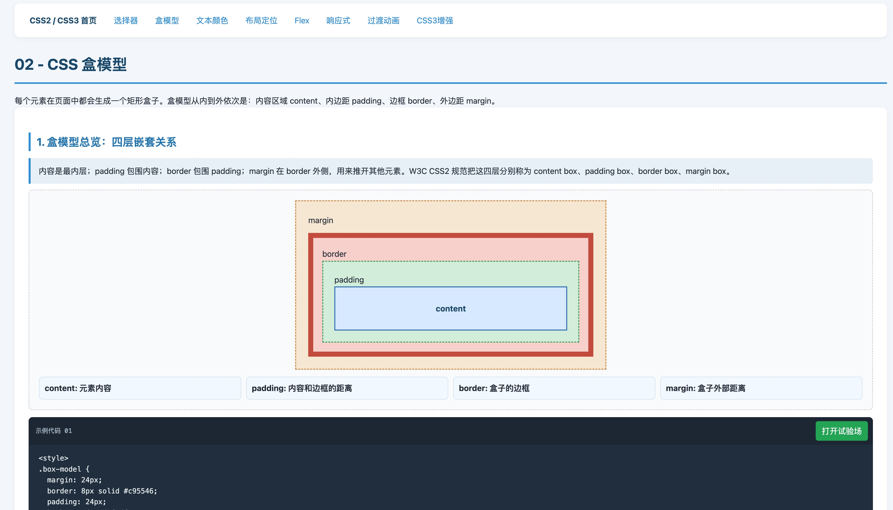
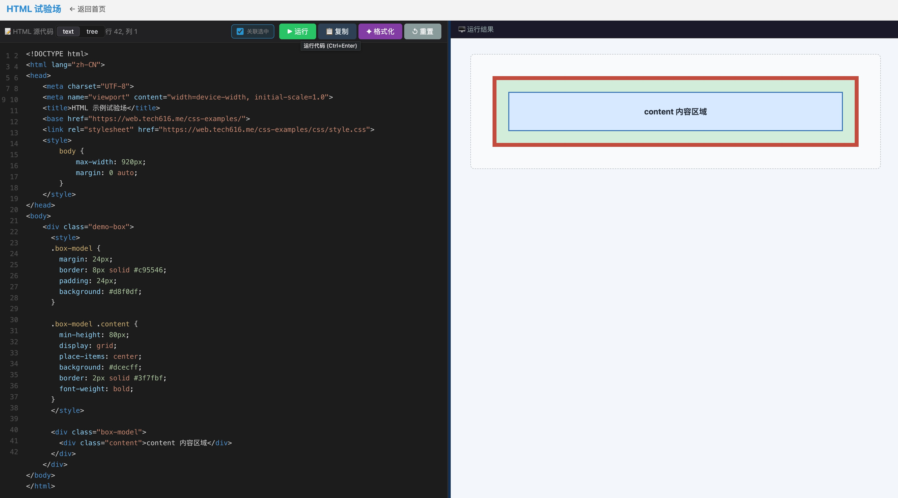

# 前端教学示例中心
> 示例地址: [https://web.tech616.me](https://web.tech616.me)

> HTML / CSS / JavaScript / TypeScript 课程示例与课件






## 快速启动

### 1. 启动开发服务器

```bash
# Python 3
python3 -m http.server 8091

# Python 2
python -m SimpleHTTPServer 8091
```

默认监听 `http://localhost:8091`。

### 2. 访问页面

启动后在浏览器打开：

- **首页**: http://localhost:8091
- **HTML 课程**: http://localhost:8091/html-examples/
- **CSS 课程**: http://localhost:8091/css-examples/
- **JavaScript 课程**: http://localhost:8091/js-examples/
- **TypeScript 课程**: http://localhost:8091/ts-example/

## 项目结构

```
frontend-tutorial/
├── index.html                    # 首页
├── html-examples/                # HTML 教学示例
├── css-examples/                 # CSS 教学示例
├── js-examples/                  # JavaScript 教学示例
├── ts-example/                   # TypeScript 教学示例
│   ├── src/                      # TypeScript 源码
│   ├── dist/                     # 编译输出
│   ├── index.html                # TS 示例首页
│   └── *.html                    # TS 示例页面（带语法高亮）
├── HTML.pptx                     # HTML 课件
├── CSS2_CSS3.pptx                # CSS 课件
├── JavaScript.pptx               # JavaScript 课件
├── TypeScript_Introduction.pptx  # TypeScript 课件
├── Dockerfile                    # Docker 配置
├── docker-compose.yml            # Docker Compose 配置
└── .dockerignore                 # Docker 忽略文件
```

## TypeScript 编译

如果需要单独编译 TypeScript 文件：

```bash
# 编译所有文件
tsc --project ts-example/tsconfig.json

# 监听模式
tsc --project ts-example/tsconfig.json --watch

# 运行编译后的 JS
node ts-example/dist/01-基本类型.js
```

## Docker 部署

**方式一：docker-compose（推荐）**

```bash

# 停止
docker compose down 

# 构建并启动
docker compose up -d --build

```

**方式二：docker 命令**

```bash
# 构建镜像
docker build -t frontend-tutorial .

# 运行容器
docker run -d -p 8091:8091 --name frontend-tutorial frontend-tutorial
```

访问: http://localhost:8091

## 相关资源

- [Bun 官方文档](https://bun.sh/docs)
- [TypeScript 官方文档](https://www.typescriptlang.org/docs/)
- [TypeScript 入门教程](https://ts.xcatliu.com/)
